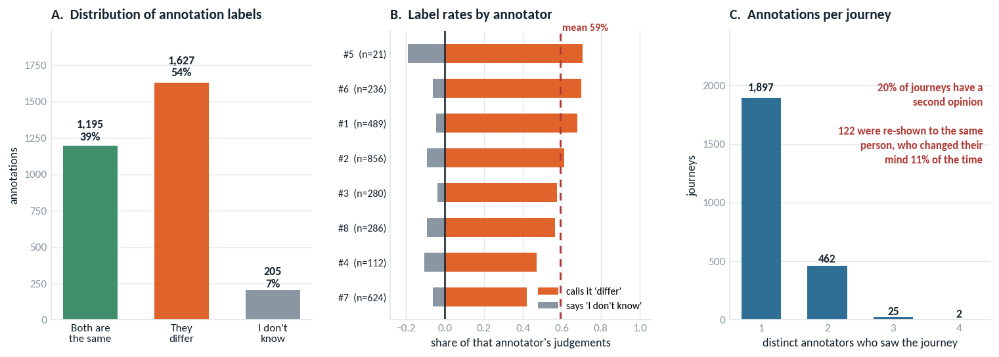
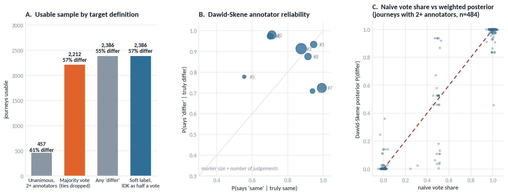
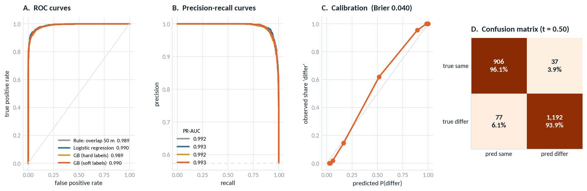
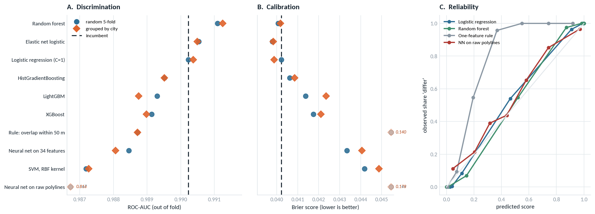
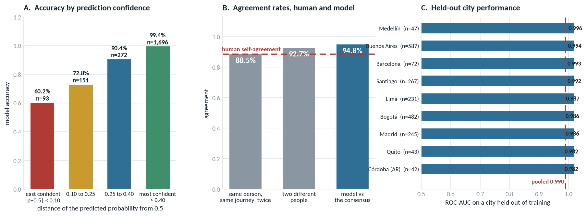
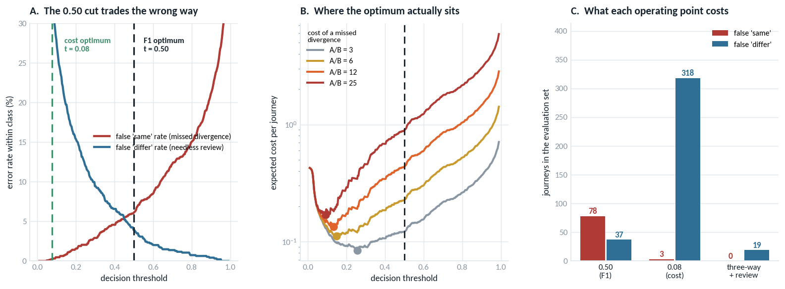

# Route divergence detection

**Technical report, Part 2: model prototyping**

Scope: a model that decides, for a given journey, whether the route actually driven matches the
route the pricing engine predicted. Ground truth is a human labelling exercise, so the target is a
human judgement rather than a geometric fact.

Source notebook: `cabify_part2_v4.ipynb`. All figures referenced here are in `Figures/`. Every
number quoted is out of fold unless stated otherwise.

---

## Executive summary

1. **The problem is close to solved by one feature.** Thresholding the share of the real route lying
   within 50 m of the estimate gives ROC-AUC 0.9887. A 34-feature logistic regression gives 0.9902.
   Ten alternative algorithms, including three tree ensembles, a kernel SVM and two neural networks,
   produced no candidate that beats the linear model on both discrimination and calibration under
   both cross-validation schemes.
2. **The value of the model is its calibration, not its ranking.** The one-feature rule scores 0.1397
   on Brier against 0.0402 for the logistic regression. Calibration is what makes a cost-derived
   threshold and a "not sure" band possible, and neither is available from a raw geometric score.
3. **Hyperparameter optimisation is not justified at this sample size.** The regularisation objective
   is flat across two orders of magnitude and nested cross-validation makes the model marginally
   worse (0.9896 against 0.9902).
4. **The model is at the human agreement ceiling.** It matches the annotator consensus 94.8% of the
   time, against 92.7% between two annotators and 88.5% for a single annotator with themselves.
5. **The largest single improvement came from the decision rule, not the model.** Replacing the
   F1-optimal threshold with a three-way band derived from the cost of each error takes missed
   divergences from 78 to 0 on the evaluation set while leaving needless flags unchanged at 35
   against 37. No retraining involved.
6. **Recommendation:** deploy the calibrated logistic regression behind a three-way accept / review /
   flag rule, automating 75.5% of volume at 97.9% accuracy and routing the remaining 24.5% to human
   review.

---

## 1. Problem definition

Pricing happens before the trip, from a predicted route. If the driver diverges materially, the fare
was computed on a trip that did not occur. Manual verification does not scale, so the question is
whether the check can be automated.

One framing point governs everything that follows. The model does not predict whether two polylines
are geometrically identical, which would be a closed-form calculation requiring no annotators. It
predicts **what a person would say when shown the two routes on a map**. The target is subjective and
measured with noise, which sets a ceiling on achievable accuracy and determines what the model should
be benchmarked against.

The intended use is triage and monitoring, not adjudication of individual fares.

---

## 2. Data and label quality

| Quantity | Value |
|---|---|
| Annotation records | 3,027 |
| Distinct journeys | 2,386 |
| Annotators | 8 |
| Cities / countries | 28 / 7 |
| Label mix | 54% "they differ", 39% "both are the same", 7% "I don't know" |
| Journeys with 2 or more annotators | 489 (20%) |
| Journeys seen by 3 or more | 27 |
| Route point counts | 5 to 1,886 |

Coordinate lists are repeated on every annotation row, so routes are deduplicated to one row per
journey before any modelling. A small number of journeys were shown twice to the same annotator, so a
single vote per annotator per journey is resolved first.



Three observations drive the design decisions in section 3.

**Annotators apply materially different bars.** The "differ" rate runs from 39% (annotator #7, 624
judgements) to 69% (#5, on only 21 judgements). Between the two heaviest labellers the gap is 56%
against 39%. A journey's label depends in part on who opened it.

**"I don't know" is 7% of judgements and is not missing data.** It marks pairs near that annotator's
decision boundary, which is information about the journey.

**The consensus is thin and noisy.** Only 20% of journeys have a second opinion. More usefully, 122
journeys were re-shown to the same annotator, who changed their own answer **11.5%** of the time.
Across different annotators, pairwise agreement is **92.7%** (Cohen-style kappa 0.850 over 478
pairs). These two numbers, not 100%, are the benchmarks the model should be judged against.

---

## 3. Target definition

The aggregation choice is the first substantive modelling decision. Of the 489 multi-annotator
journeys, 227 are a unanimous "differ", 149 a unanimous "same" and 30 are genuine disagreements.
Because most such journeys have exactly two annotators, **any disagreement is automatically a tie**;
a 2-to-1 majority requires three annotators and only 27 journeys have them.

| Strategy | Journeys retained | Trade-off |
|---|---|---|
| Unanimous, 2+ annotators | 457 | Cleanest signal, discards 81% of data and specifically the hard cases |
| Majority vote, ties dropped | 2,212 | Standard, but treats one unconfirmed vote as equal to two agreeing ones |
| Any "differ" | 2,386 | Conservative, inherits the strictest annotator's threshold |
| **Soft label (adopted)** | **2,386** | Retains everything and carries uncertainty forward |

The adopted target is a soft label in which **"I don't know" contributes half a vote to each side**,
with the sample weight carrying the amount of evidence behind the label:

```python
lab["p_differ"] = (lab.n_diff + 0.5 * lab.n_idk) / lab.n_ann
lab["weight"]   = lab.n_ann
```

Two consequences. 57 journeys previously carried a fully confident label despite containing an
abstention, for example one "differ" plus one "I don't know" scoring 1.0, identical to two agreeing
annotators. A further 174 journeys (144 unanimous "I don't know" plus the 30 ties) had no label at
all and were being dropped, which implicitly assumes they are missing at random. They are not: they
are the ambiguous cases.

Training on a continuous target is weighted cross-entropy, implemented as each journey entering twice
with weights `p_differ` and `1 - p_differ`. **Evaluation** uses the majority vote on the 2,212
journeys where one exists, so the ambiguous journeys train the model but never grade it.



A Dawid-Skene model was fitted as a diagnostic, with a latent binary truth per journey and a 2 by 3
confusion matrix per annotator, treating "I don't know" as an emitted category. The estimates reveal a
severity axis rather than a competence axis: some annotators almost never call identical routes
different but miss a quarter of real divergences, and others are the mirror image. Reweighting flips
the majority on almost nothing, since 80% of journeys carry a single vote, so it was not adopted as
the production label.

Handling "I don't know" properly costs 0.0006 ROC-AUC (0.9908 to 0.9902). This is the expected
direction: the model now fits 174 genuinely ambiguous journeys while still being graded on the
easier subset. The lower number is the more honest one.

---

## 4. Feature engineering

34 features, all derived from the two coordinate lists alone. Coordinates are projected to metres with
a local equirectangular projection centred on each route, so distances are directly interpretable.
Measured against geodesic distance on this dataset, the projection error has a median of 0.0005% and a
maximum of 0.037%, orders of magnitude below the annotation noise.

| Group | Content |
|---|---|
| Scale | Route lengths, ratio, detour ratio |
| Endpoints | Start and end gaps |
| Distance profile | Mean, median, p90, max of pointwise separation, symmetrised; computed point to *segment* so values do not depend on sampling density |
| Overlap fractions | Share of route within 10, 25, 50, 100, 200 m |
| Sustained detour | Longest contiguous stretch beyond 30 m, episode count, deviated fraction |
| Curve similarity | Discrete Frechet and DTW on arc-length-resampled 40-point routes |
| Shape | Bearing profile differences, bounding-box IoU |
| Normalisation | Every distance also divided by route length |

The sustained-detour group encodes human perception rather than average error. A route 40 m off along
its whole length looks identical to a person, while a route that is perfect except for one four-block
detour does not. Mean distance cannot separate these; a longest-run statistic can.

City is deliberately excluded as an input, so the model cannot learn per-city label prevalences
instead of geometry. It is used only to group cross-validation.

Cost is approximately 9 ms per journey single-threaded, so a full day of volume is a few CPU-minutes.

---

## 5. Modelling

Protocol: one row per journey, 5-fold stratified cross-validation for the primary numbers and 5-fold
grouped by city for generalisation, out-of-fold reporting only.

### 5.1 Baselines

| Model | ROC-AUC | PR-AUC | Brier |
|---|---|---|---|
| Rule: overlap within 50 m | 0.9887 | 0.9918 | 0.1397 |
| **Logistic regression** | **0.9902** | **0.9931** | **0.0402** |
| Gradient boosting, hard labels | 0.9889 | 0.9921 | 0.0453 |
| Gradient boosting, soft labels | 0.9895 | 0.9925 | 0.0406 |



Every model lands within 0.002 ROC-AUC of every other, and the one-feature rule is among them. There
is little ranking problem in this data. What separates the candidates is calibration: the rule's
Brier score of 0.1397 reflects that `1 - overlap` is a score rather than a probability, and a raw
score cannot be thresholded by cost, cannot support a "not sure" output, and cannot be aggregated
into a monitoring signal.

### 5.2 Model search

Ten candidates were evaluated under both CV schemes, with a paired bootstrap over journeys against
the incumbent on both metrics. The bar for replacement was set in advance: beat the incumbent out of
fold, on both schemes, and on calibration as well as ranking.

| Model | ROC-AUC (random) | ROC-AUC (by city) | Brier (random) | Brier (by city) |
|---|---|---|---|---|
| Random forest | 0.9911 | 0.9913 | 0.0401 | 0.0402 |
| Elastic net logistic | 0.9905 | 0.9905 | 0.0398 | 0.0398 |
| **Logistic regression (C=1)** | **0.9902** | **0.9904** | **0.0402** | **0.0399** |
| HistGradientBoosting | 0.9895 | 0.9895 | 0.0409 | 0.0406 |
| XGBoost | 0.9891 | 0.9890 | 0.0417 | 0.0421 |
| LightGBM | 0.9893 | 0.9887 | 0.0414 | 0.0424 |
| Rule: overlap within 50 m | 0.9887 | 0.9887 | 0.1397 | 0.1397 |
| Neural net, 34 features | 0.9885 | 0.9881 | 0.0433 | 0.0441 |
| SVM, RBF kernel | 0.9872 | 0.9873 | 0.0442 | 0.0449 |
| Neural net, raw polylines | 0.8666 | 0.8163 | 0.1494 | 0.1778 |

Paired bootstrap against the incumbent, 95% intervals:

| Model | Delta ROC-AUC | Delta Brier |
|---|---|---|
| Random forest | +0.0009 [-0.0003, +0.0021] | -0.0001 [-0.0021, +0.0019] |
| Elastic net logistic | +0.0003 [+0.0000, +0.0007] | -0.0004 [-0.0012, +0.0001] |
| LightGBM | -0.0009 [-0.0024, +0.0005] | +0.0011 [-0.0022, +0.0043] |
| XGBoost | -0.0011 [-0.0026, +0.0004] | +0.0015 [-0.0014, +0.0043] |
| SVM, RBF kernel | -0.0030 [-0.0059, -0.0004] | +0.0040 [+0.0018, +0.0061] |
| Neural net, 34 features | -0.0017 [-0.0040, +0.0001] | +0.0031 [+0.0009, +0.0054] |
| Neural net, raw polylines | -0.1240 [-0.1379, -0.1097] | +0.1093 [+0.1013, +0.1169] |



**Conclusion: retain logistic regression.** Random forest has the best ROC-AUC point estimate but its
interval contains zero on both metrics, and it costs 400 trees at serving time. The elastic net is
the only candidate whose ROC-AUC interval clears zero, at +0.0003, which is statistical significance
without practical significance; its Brier interval still contains zero. The kernel method and the
neural net on features are worse on calibration by margins that do clear zero.

Two results are worth recording beyond the selection decision.

The **elastic net result validates the collinearity argument**. An L1 penalty is free to discard
correlated features entirely and loses three ten-thousandths of a point, which is what "collinear"
means operationally. This is consistent with permutation importance peaking at only 0.0149 ROC-AUC
for any single feature (see `Figures/F_importance_and_errors.png`).

The **neural network on raw polylines loses 0.12 ROC-AUC**, holding under both splits, and is the one
candidate that generalises worse across cities than within them (0.8163 grouped against 0.8666
random). At this sample size the hand-engineered geometry encodes information the network cannot
recover from 128 normalised coordinates. This is a statement about n equal to 2,212, not about the
approach.

Two options could not be tested in this environment and remain open rather than rejected: a proper
sequence model over the coordinate series, which requires a deep-learning framework, and an
OSM-snapped road-edge representation, which requires network access to a map server.

### 5.3 Hyperparameter optimisation

Nested cross-validation, with the grid selected inside each outer fold and the outer fold scored
once. The objective is Brier rather than ROC-AUC, because ROC-AUC is invariant to monotone
transformations of the score and is therefore indifferent to the property being bought.

| Configuration | ROC-AUC | Brier |
|---|---|---|
| Logistic regression, default C=1 | 0.9902 | 0.0402 |
| Logistic regression, nested-CV tuned | 0.9896 | 0.0403 |
| LightGBM, default | 0.9893 | 0.0414 |
| LightGBM, nested-CV tuned | 0.9903 | 0.0395 |

Tuning gain over the default, paired bootstrap: ROC-AUC **-0.0006 [-0.0019, +0.0002]**, Brier
**+0.0001 [-0.0003, +0.0005]**. Tuned LightGBM against the default incumbent: ROC-AUC +0.0001
[-0.0011, +0.0014], Brier -0.0007 [-0.0033, +0.0018]. Both straddle zero.

Three pieces of evidence against tuning here (see `Figures/H_hyperparameter_tuning.png`):

- The objective is flat. Brier moves 0.0002 between C of 0.3 and C of 10, while the fold-to-fold
  standard deviation at each of those points is 0.0022 to 0.0029, an order of magnitude larger.
- Tuning made the linear model slightly **worse** out of fold, the diagnostic signature of a search
  fitting inner-fold noise.
- The selected parameters are unstable. Across outer folds the linear model picked C of 1/L1, 10/L2,
  3/L1, 1/L1 and 3/L2; LightGBM picked 31 leaves in one fold and 7 in three others.

**Conclusion: no tuning.** Retain `C=1.0, penalty="l2"`. This is a property of the current sample
size and should be revisited if labelling depth increases substantially.

---

## 6. Evaluation

### 6.1 Human agreement ceiling and confidence structure

| Comparison | Agreement |
|---|---|
| Same annotator, same journey, shown twice | 88.5% |
| Two different annotators, same journey | 92.7% (kappa 0.850) |
| **Model against the consensus** | **94.8%** |



The model tracks the consensus more closely than the panel tracks itself. The caveat is that it was
trained on that consensus, so it is optimised for the target it is graded against, while each
annotator is judged against a consensus they only partly shaped. The defensible claim is that the
model is about as reliable as one annotator, which is sufficient for a system replacing bulk manual
review.

The error structure is more actionable than the headline. Accuracy by prediction confidence:

| Distance of predicted probability from 0.5 | Accuracy | Journeys |
|---|---|---|
| below 0.10 | 60.2% | 93 |
| 0.10 to 0.25 | 72.8% | 151 |
| 0.25 to 0.40 | 90.4% | 272 |
| above 0.40 | 99.4% | 1,696 |

Errors are not scattered. They concentrate in a band the model identifies by itself, before any label
is consulted: the least confident 23% of journeys contain roughly 90% of all errors. This is the
property the operating point in section 7 exploits.

### 6.2 Generalisation across cities

Holding out an entire city, ROC-AUC ranges from 0.982 (Quito, 43 journeys) to 0.996 (Medellin, 47).
Pooled grouped-by-city cross-validation gives 0.9904 against 0.9902 for random folds, which is
indistinguishable. The model search in section 5.2 was run under both schemes and the ordering did
not change.

Given that the sample spans Spain, Argentina, Colombia, Chile, Peru, Ecuador and Mexico, with very
different street grids and trip lengths, this is reasonable evidence that the features capture
geometry rather than local idiosyncrasy.

---

## 7. Operating point

At the F1-optimal threshold of 0.50 the confusion matrix is asymmetric in the wrong direction: **78
missed divergences** (6.1% of true divergences) against **37 needless flags** (3.9% of true matches).
The model is roughly 1.5 times more likely to make the expensive error than the cheap one.

This is not a model bias. It is the arithmetic of applying a 0.50 cut to a calibrated probability in
a problem where the two errors have different costs. F1 weights precision and recall equally, which
is a statement about the metric and not about the business.

For a calibrated probability the two-way cost optimum is closed-form at `B / (A + B)`, where A is the
cost of a missed divergence and B the cost of a needless flag. Adding the cost R of a precautionary
review yields both edges of a three-way band in the same step: accept below `min(R/A, B/(A+B))`, flag
above `max(1 - R/B, B/(A+B))`, review in between.

Cost assumptions, owned by pricing rather than derived from data: A = 12, B = 1, R = 0.49, the last
chosen so that routed volume respects a 25% review capacity. The sensitivity grid in the notebook
spans A from 3 to 25.

| Operating point | Missed divergences | Needless flags | Sent to review |
|---|---|---|---|
| 0.50, F1 optimum | 78 | 37 | none |
| 0.077, cost-optimal two-way | 3 | 318 | none |
| **0.041 / 0.510, three-way** | **0** | **35** | **24.5%** |



Moving to the three-way band takes missed divergences to zero while leaving needless flags
essentially unchanged. It does not trade one error against the other, which the two-way cut is forced
to do at the cost of flagging a third of all matching journeys. The band absorbs the ambiguity instead
of resolving it at the customer's expense.

Two alternatives were tested and rejected:

- **Cost-weighted training.** Multiplying the positive class weight by the cost ratio reduces missed
  divergences to 7 but more than doubles the Brier score, from 0.0402 to 0.0876. It achieves the
  reweighting by corrupting the probability, hard-codes today's cost ratio into the model weights, and
  invalidates the comparison in section 6.1.
- **Encoding cost in the soft label.** Rejected on auditability grounds. The soft label is a statement
  about what the annotators believed and is the reference for the human agreement ceiling. Costs
  belong in the decision, not in the ground truth.

An independent consistency check: of the 174 journeys the annotators could not agree on, 46% fall in
the review band against 22% of the rest. Measured in sample, so a coherence check rather than
evidence.

**One caveat on the zero.** Zero missed divergences on 2,212 journeys is not zero in production. It
means the accept region contained no journey annotators had called divergent, at this sample size and
with the documented label noise. The residual risk has been pushed below what this dataset can
measure and requires monitoring, not celebration.

---

## 8. Recommendation

Deploy the calibrated logistic regression behind the three-way rule.

| Predicted P(differ) | Decision | Share on this sample |
|---|---|---|
| below 0.041 | accept as matching | 20.2% |
| 0.041 to 0.510 | send to human review | 24.5% |
| above 0.510 | flag as diverging | 55.3% |

Automated share: 75.5% of volume at 97.9% accuracy, with zero measurable missed divergences. The
accuracy figure is lower than the 99.4% achieved on the symmetric high-confidence band, and that is
the intended outcome: the residual errors are needless flags rather than mispriced journeys.

Shares reflect this sample, in which 57.4% of journeys genuinely differ. That base rate is a property
of how the sample was drawn, not of production traffic, so accept and flag shares will move on live
volume. The review share is the quantity to hold steady, since it is what the capacity constraint was
set against.

Implementation notes:

- The two cuts are **configuration derived from three costs**, not constants. If any cost is revised,
  recompute the cuts. One division, no retraining. This is a primary reason cost-weighted training was
  rejected.
- The artefact is refitted on all 2,386 journeys including the ambiguous ones, using the soft target
  and evidence weights. Cross-validation estimates performance; it does not produce the artefact.
- The artefact carries the feature names **in order**, the decision configuration with its costs, the
  out-of-fold metrics, a hash of the feature module and library versions. Feature-order drift is a
  silent failure mode and this makes it detectable.
- Aggregate before acting. The score is far more valuable summed by city, hour, road type and routing
  engine version than per journey.
- Route the review band back to annotators. It is by construction the highest value-per-label pool
  available and forms a natural active-learning queue, provided the reviewer verdict is written back
  and joined to the features that produced it.
- Monitor review-band volume first. It moves before accuracy does and requires no labels.

---

## 9. Limitations and further work

**Measurement is now the binding constraint, not modelling.** With 80% of journeys carrying a single
judgement and self-consistency at 88.5%, the consensus being scored against is itself noisy, and the
gap between the model and that consensus is the same order of magnitude as the noise in it. The best
model challenger closed roughly 3% of the remaining headroom, an amount that would move if 122
journeys were relabelled. A fixed labelling budget is better spent on fewer journeys with more
annotators each, concentrated on the review band.

**Annotator calibration before model work.** A shared rubric with worked examples covering how much
detour counts, GPS noise at pickup and when to use "I don't know" would compress the 39% to 69%
severity spread far more cheaply than any modelling change.

**Map context is the largest available modelling gain and is absent.** A 100 m deviation along a
parallel street differs from 100 m across a river or onto a motorway. Snapping both routes to the OSM
road network and comparing edge sequences matches how a person reads a map. Untested here for want of
network access.

**A three-class model would be more principled than a band.** 144 journeys carry a unanimous "I don't
know", a genuine ambiguity class rather than noise. The review band is cost-derived, which is an
improvement on a heuristic width, but it still infers ambiguity from proximity to the boundary rather
than predicting it.

**The cost ratio is an assumption.** A = 12 came from a conversation, not from data, and review volume
moves substantially across the plausible range. It requires an owner in pricing and a monitoring line.

Additional gaps:

- No time or traffic features. A route differing geometrically but taking the same time may be
  economically equivalent for pricing, which is the underlying question.
- The 174 ambiguous journeys train the model but cannot be scored, so every headline metric is
  computed on a marginally easier population than production.
- The task in this sample is easy. Most divergences are large and obvious. Whether that reflects the
  routing engine's true error distribution or the sampling design should be verified before these
  figures are quoted externally.
- City coverage is uneven. Buenos Aires and Bogota are half the data and 19 cities have fewer than 50
  journeys, so the transfer result rests on the nine with meaningful volume.

---

## Appendix A. Reproducibility

| Item | Detail |
|---|---|
| Notebook | `cabify_part2_v4.ipynb` |
| Modules | `p2_lib.py` (geometry, features, Dawid-Skene, city assignment), `je_style.py` (figures) |
| Artefact | `Model/route_divergence_model.joblib` (2.6 KB), `Model/route_divergence_config.json` |
| Figures | `Figures/A_annotation_review.png` to `Figures/I_decision_threshold.png` |
| Dependencies beyond the standard stack | `lightgbm`, `xgboost` (section 5.2 only), `joblib` |
| Runtime | approximately 5 minutes end to end |

Loading the artefact:

```python
import joblib
art = joblib.load("Model/route_divergence_model.joblib")
p = art["model"].predict_proba(features[art["features"]])[:, 1]
cfg = art["decision"]          # accept_below, flag_above, and the costs they came from
```

## Appendix B. Figure inventory

| File | Content |
|---|---|
| `A_annotation_review.png` | Label distribution, per-annotator severity, annotations per journey |
| `B_target_definition.png` | Target definitions, Dawid-Skene reliability, vote share against weighted posterior |
| `C_feature_separation.png` | Feature distributions by label, joint distribution of the two leading features |
| `D_baseline_performance.png` | Baseline ROC, precision-recall, calibration, confusion matrix |
| `E_ceiling_and_transfer.png` | Accuracy by confidence, agreement benchmarks, held-out city performance |
| `F_importance_and_errors.png` | Univariate discriminative power, misclassification examples |
| `G_model_search.png` | Ten-model comparison across both CV schemes, reliability curves |
| `H_hyperparameter_tuning.png` | Regularisation curve, bootstrap of the tuning gain, nested-CV comparison |
| `I_decision_threshold.png` | Error rates by threshold, expected cost curves, operating point comparison |
